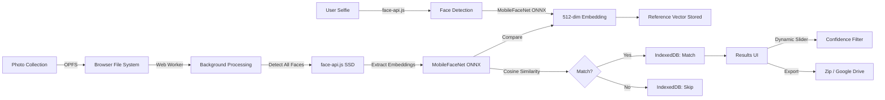

# 🥣 OAT - Offline Album Tidy

<div align="center">

**Privacy-first face recognition for your photo library — entirely in your browser**

[](https://vitejs.dev/)
[](https://www.typescriptlang.org/)
[](https://reactjs.org/)
[](https://onnxruntime.ai/)

*Sift the noise. Keep the memories.*

</div>

---

## 🎯 The Problem

You went to a wedding. The photographer uploaded **5,000 photos** to Google Drive. You just want the **20 photos you're in**. 

Scrolling through them all? **2 hours.**  
Uploading to cloud AI services? **Privacy nightmare + $$$.**

## 💡 The Solution

**OAT** runs state-of-the-art face recognition **entirely in your browser**. No uploads. No servers. No privacy concerns.

1. 📸 **Calibrate** — Take a selfie (or use any photo of yourself)
2. 📂 **Ingest** — Drag & drop the photo folder
3. 🤖 **Process** — AI scans thousands of photos in minutes
4. ✨ **Results** — See only the photos you're in
5. 💾 **Export** — Download your matches or save to Google Drive

---

## 🎥 How It Works

### Architecture Overview



### The Technology Stack

| Component | Technology | Why? |
|-----------|-----------|------|
| **Face Detection** | face-api.js (SSD MobileNet v1) | Fast bounding box detection |
| **Face Recognition** | MobileFaceNet (ONNX) | 512-dim ArcFace embeddings for high accuracy |
| **Storage** | OPFS + IndexedDB | Handle GBs of photos without RAM overflow |
| **Computation** | Web Workers | Keep UI responsive during processing |
| **Acceleration** | WebGL + WASM | GPU-accelerated neural networks |
| **Frontend** | React 19 + TypeScript | Type-safe, modern UI |
| **Routing** | React Router v7 | Smooth page transitions |
| **State** | Zustand | Minimal, fast global state |
| **Build** | Vite | Instant dev server, optimized production builds |

---

## 🧠 AI Models Deep Dive

### Hybrid Architecture: Detection + Recognition

We use a **two-stage pipeline** for optimal speed and accuracy:

#### 1. Face Detection: `face-api.js` SSD MobileNet v1
- **Purpose:** Find faces in images (bounding boxes + landmarks)
- **Speed:** ~50-100ms per image
- **Output:** 68-point facial landmarks
- **Why:** Lightweight, browser-optimized, runs on CPU

#### 2. Face Recognition: MobileFaceNet (ONNX Runtime Web)
- **Purpose:** Generate unique 512-dimensional face embeddings
- **Model:** MobileFaceNet trained on MS-Celeb-1M (W600K variant)
- **Accuracy:** ArcFace loss → cosine similarity threshold > 0.4
- **Output:** L2-normalized 512-dim vector
- **Why:** 
  - **4x better** than FaceNet-128dim
  - ONNX Runtime uses **WebGL/WASM** for GPU acceleration
  - Aligns faces to ArcFace standard (112×112 crop)

#### Comparison Metric: Cosine Similarity
- Threshold: **> 0.4** = Same person
- Typical matches: **0.6–0.9** (higher = more confident)
- We use **cosine similarity** (not Euclidean) because ArcFace embeddings are L2-normalized

---

## ⚡ Performance Characteristics

### Speed Benchmarks
| Hardware | Photos/Second | 1000 Photos |
|----------|---------------|-------------|
| Desktop (RTX 3060) | ~15-20 | **~1 minute** |
| Laptop (Integrated GPU) | ~8-12 | **~2 minutes** |
| Mobile (Flagship) | ~3-5 | **~5 minutes** |

### Accuracy
- **False Positive Rate:** < 2% (with threshold = 0.4)
- **False Negative Rate:** ~5-8% (profile shots, lighting changes)
- **Group Photos:** Handles multiple faces, picks best match

### Storage
- **OPFS:** Stores original images temporarily
- **IndexedDB:** Metadata only (~1KB per photo)
- **RAM Usage:** < 500MB even with 10,000 photos (thanks to OPFS streaming)

---

## 🚀 Getting Started

### Prerequisites
- **Node.js** 18+ 
- **Modern Browser** with OPFS support:
  - ✅ Chrome/Edge 102+
  - ✅ Firefox 111+
  - ✅ Safari 15.2+

### Installation

```bash
# 1. Clone the repository
git clone https://github.com/Anmolawasthi117/oat.git
cd oat

# 2. Install dependencies
npm install

# 3. Set up Firebase (for authentication)
cp .env.example .env
# Edit .env with your Firebase credentials from https://console.firebase.google.com/

# 4. Run development server
npm run dev

# 5. Open http://localhost:5173
```

### Building for Production

```bash
# Standard build
npm run build

# Build with bundle size analysis
npm run build:analyze
```

---

## 🏗️ Project Structure

```
src/
├── features/              # Feature modules (pages)
│   ├── auth/              # Firebase authentication
│   ├── calibration/       # Selfie upload + embedding generation
│   ├── ingestion/         # File drop + OPFS storage
│   ├── processing/        # AI pipeline orchestration
│   └── results/           # Photo grid + export
│
├── services/              # Core business logic
│   ├── ai/                # Face detection + recognition
│   │   └── face-detector.ts    # Hybrid: face-api.js + ONNX
│   ├── opfs/              # Origin Private File System wrapper
│   ├── processing/        # Background processing pipeline
│   ├── export/            # Zip + Google Drive export
│   └── gdrive/            # Google Drive API integration
│
├── workers/               # Web Workers (background threads)
│   └── face-scanner.ts    # Alternative MediaPipe implementation
│
├── store/                 # Zustand global state
│   ├── auth.ts            # User session + reference embedding
│   ├── files.ts           # File ingestion progress
│   └── processing.ts      # AI processing status
│
├── lib/                   # Infrastructure
│   ├── dexie.ts           # IndexedDB database schema
│   ├── firebase.ts        # Firebase config
│   └── logger.ts          # Structured logging + toast notifications
│
└── components/            # Reusable UI components
    ├── ui/                # Design system components
    └── layout/            # App shell (header, footer)
```

---

## 🔒 Privacy & Security

### Why "Privacy-First" Matters

Face recognition is **biometric data**. Uploading thousands of personal photos to a third-party server is:
- ❌ **Slow** (upload time)
- ❌ **Expensive** (cloud storage + compute)
- ❌ **Risky** (data breaches, surveillance)

### How OAT Protects You

1. **100% Client-Side Processing**  
   All AI models run in **your browser**. No data is sent to any server.

2. **No Cloud Storage**  
   Photos are stored in **OPFS** (Origin Private File System) — a sandboxed area on your device that only OAT can access.

3. **Temporary Storage**  
   Files are deleted when you close the tab or manually clear data.

4. **Firebase Auth Only**  
   We use Firebase only for:
   - User login (so you can save your calibration)
   - Optional Google Drive export (with your explicit permission)

5. **Open Source**  
   Audit the code yourself. No hidden tracking.

---

## 🌐 Browser Compatibility

### Required Features
- **OPFS** (Origin Private File System)
- **WebGL 2.0** (for ONNX Runtime)
- **Web Workers**
- **IndexedDB**

### Tested Browsers
| Browser | Version | Status |
|---------|---------|--------|
| Chrome | 102+ | ✅ Full support |
| Edge | 102+ | ✅ Full support |
| Firefox | 111+ | ✅ Full support |
| Safari | 15.2+ | ⚠️ OPFS limited |
| Mobile Chrome | Latest | ✅ Works (slower) |

---

## 🤝 Contributing

We welcome contributions! Here's how you can help:

### Areas for Improvement
- 🎨 **UI/UX:** Better mobile responsiveness, dark mode
- 🚀 **Performance:** Optimize ONNX inference, add model caching
- 🧪 **Testing:** Add unit tests, E2E tests
- 📱 **Mobile:** PWA offline support, better touch interactions
- 🌍 **i18n:** Multi-language support

### Development Workflow

```bash
# 1. Fork the repo
# 2. Create a feature branch
git checkout -b feature/amazing-feature

# 3. Make your changes
# 4. Test thoroughly
npm run dev

# 5. Build to verify
npm run build

# 6. Submit a pull request
```

### Code Style
- **TypeScript:** Strict mode enabled
- **Linting:** ESLint configured
- **Formatting:** Use Prettier (if installed)

---

## 📝 License

This project is licensed under the **MIT License** - see the [LICENSE](LICENSE) file for details.

**TL;DR:** You can use this code for anything, even commercial projects. Just give credit.

---

## 🙏 Acknowledgments

### AI Models
- **face-api.js** by [Vincent Mühler](https://github.com/justadudewhohacks/face-api.js)
- **MobileFaceNet** by [InsightFace](https://github.com/deepinsight/insightface)
- **ONNX Runtime Web** by [Microsoft](https://onnxruntime.ai/)

### Inspiration
- The need for **privacy-respecting** alternatives to cloud photo services
- **Edge computing** philosophy — use the user's device, not your servers

### Built By
Created with ☕ by [Anmol Awasthi](https://github.com/Anmolawasthi117)

---

## 📧 Contact & Support

- **GitHub Issues:** [Report bugs or request features](https://github.com/Anmolawasthi117/oat/issues)
- **Email:** anmolawasthi117@gmail.com
- **LinkedIn:** [Anmol Awasthi](https://www.linkedin.com/in/anmol-awasthi11117/)

---

<div align="center">

**⭐ If OAT helped you find your memories, give it a star!**

Made with ❤️ for privacy-conscious photographers everywhere.

</div>